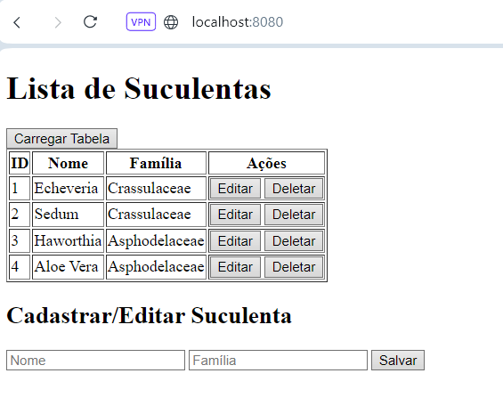

# Atividade 2

## REST SPRING BOOT - SUCULENTAS

Este projeto é uma API REST construída com Spring Boot para gerenciar suculentas, criada como parte da matéria **Laboratório de Banco de Dados III**, ministrada pelo professor **Giuliano Bertoti**. A API permite a realização de operações CRUD (Create, Read, Update, Delete) em uma lista de suculentas, com o objetivo de aprender e praticar conceitos de desenvolvimento de APIs RESTful em Java.
  
## Tecnologias Utilizadas

- **Java**: Linguagem de programação utilizada.
- **Spring Boot**: Framework usado para construir a API REST.
- **HTMX e Handlebars.js**: Ferramentas utilizadas no frontend para interação dinâmica com a API.
- **Thunder Client**: Extensão do VS Code utilizada para testar a API.

## Endpoints da API

Abaixo estão os principais endpoints disponibilizados pela API:

- `GET /suculentas` - Retorna a lista de todas as suculentas.
- `GET /suculentas/{id}` - Retorna uma suculenta específica pelo ID.
- `POST /suculentas` - Cadastra uma nova suculenta.
- `PUT /suculentas/{id}` - Atualiza as informações de uma suculenta existente.
- `DELETE /suculentas/{id}` - Remove uma suculenta da lista.

## Algumas suculentas já foram instanciadas no Controller para testes na tabela

## Testes com Thunder Client

### GET

### POST

### RESULTADO DO POST, VISUALIZADO PELO GET

## Visualização pelo localhost:8080

### GET

### POST

### POST, PUT E DELETE

